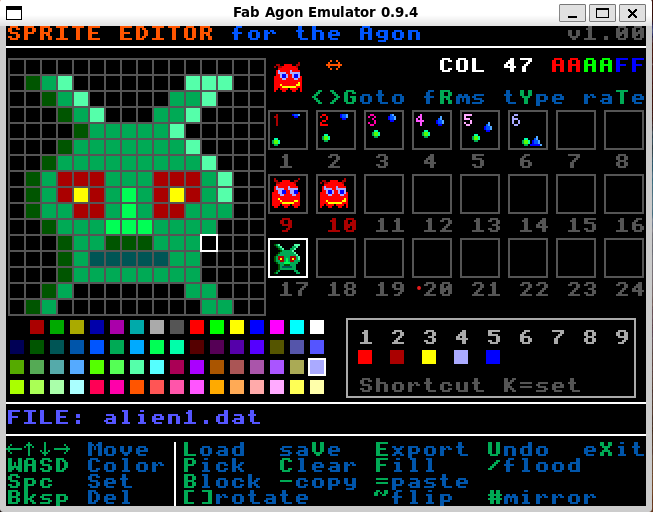

## Sprite editor
sped.bas is a sprite editor for the Agon series of retro computers.

Requires VDP2.0.0 as this enables Bitmapped backed Sprites.

Currently works in mode 8 with 64 colours, 16x16 or 8x8 sprites, maximum 24 frames.

VDP2.0.0 is the version used in console8, but can be run on an Agon Light.

v0.7 added the animated sprite

v0.9 Multiple sprite frames and animation. Improved load/save. New layout

v0.13 Added ability to export to a series of BASIC DATA statements.

 - Can export multitple bitmaps in various pixel formats.

v0.14 Add Init file "sped.ini"

- Configure 8x8 or 16x16 sprite editing
- Load and save 3 file formats (RGB888, RGB8888, RGBA2222)
- Extensions can be configured
- Multiple sprites are save from number 1 (to match bitmap numbering on screen)
- Allow Joystick mode to be configured off
- Sprites can be looped or ping-ponged and delay changed

v0.15 adds Block Fill

v0.16 adds block copy/paste/fill/clear

v0.17 adds flip/mirror, undo

v0.18 adds flood-fill

v0.19 some efficiency improvements. Max 24 bitmaps. ADL support.

v0.20 most issues fixed - first released version

v0.21 fix flood-fill bug, mirror/flip bugs.

v0.22 Add ASM subroutines and fix multiple file save/export

v1.00 Released

v1.01 add ability to set a Transparent Colour, and save Alpha accordingly
