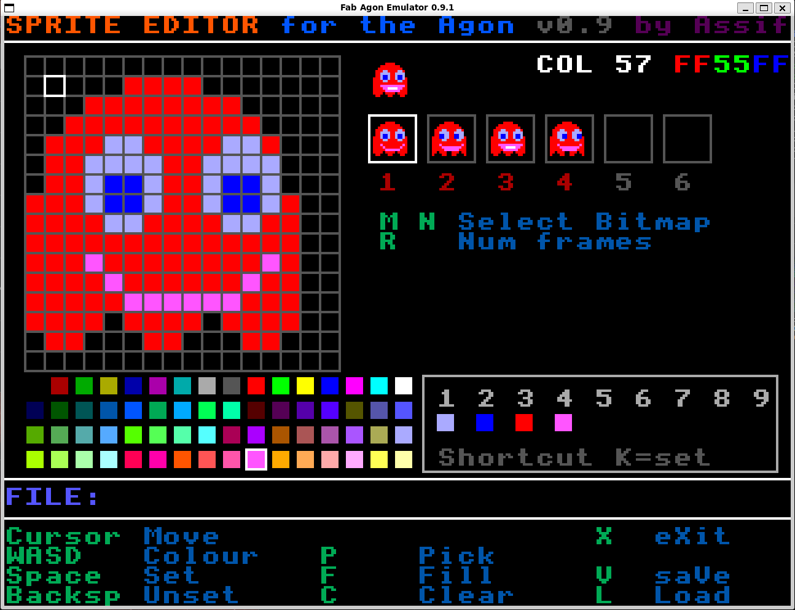

# agon_basic
Code repo for BBC Basic programs written for the Agon Light and Console8

Just a place to save stuff for now.
I will put individual programs in their own repos if they provei useful.

## Sprite editor
sped.bas is a simple sprite editor.

Requires VDP2.0.0 as this enables Bitmapped backed Sprites.
Currently works in mode 8 with i a 64 colour, 16x16 four-frame sprite.
VDP2.0.0 is the version used in console8, but can be run on an Agon Light.

v0.7 added the animated sprite
v0.9 Multiple sprite frames and animation. Improved laod/save. New layout

## mode3_cols
mode3_cols.bas 
Shows all the colours available in MODE8 (and any 64 colour mode)
Alongside my name for the colour - these are approximated from the standard HTML colour names.

## modetest.bas
Cycle through 32 modes (0-31) printing a hash in the 64 colours.
Primarily to see how the colour codes map in each of the modes.

## stars
stars.bas
Vertical scrolling stars in basic using double buffered mode

## Bitmap/Sprite tests/investigation
All of these were created to test the Adjust function of the buffered API, however to date I can't get any of them working.

### bitmap.bas 
create single colour bitmap, show and attempt adjust

### bm_buff.bas 
as bitmap.bas but try creating the buffer/bitmap using the buffer API

### modsprite.bas
Create sprite, modify using buffered API

### ms.bas
As above but try only using the buffered API functions
